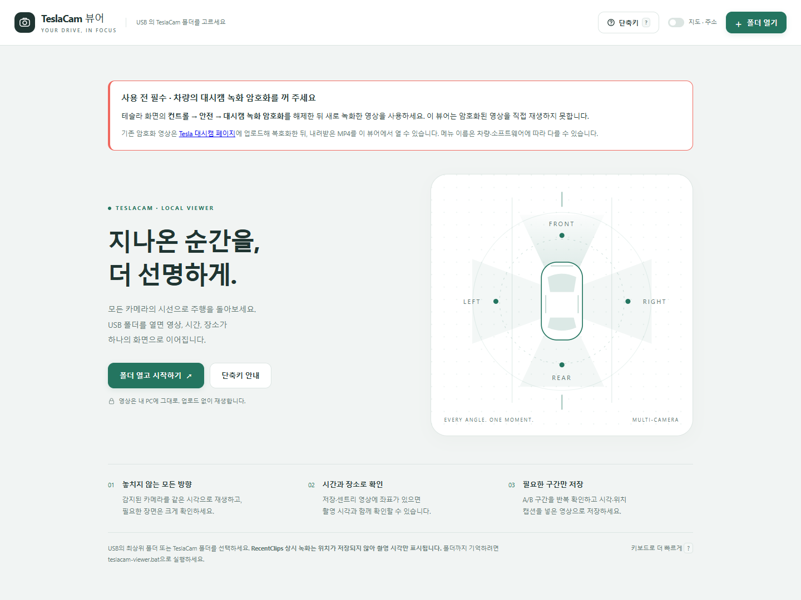
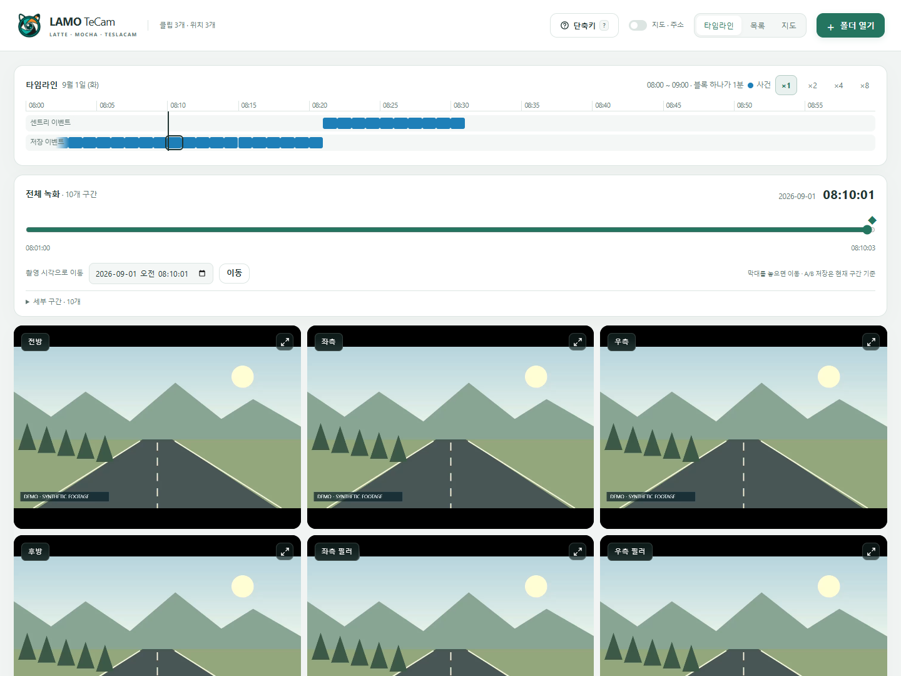
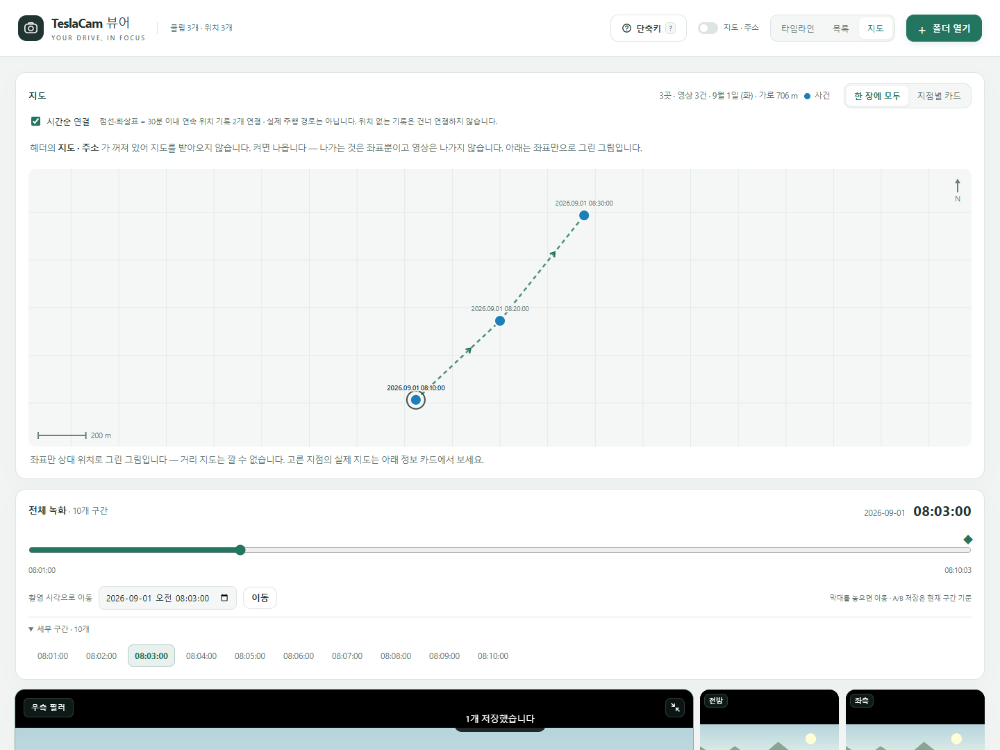
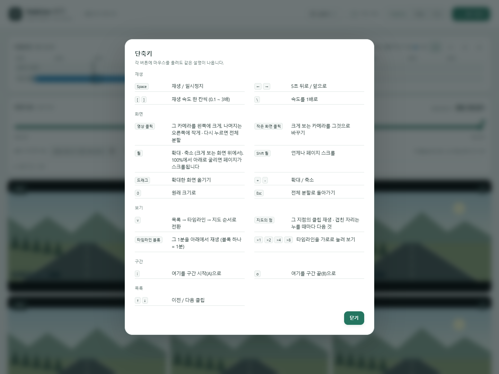

# TeslaCam Viewer

**설치 없이, 내 PC에서 보는 테슬라 블랙박스.**

USB의 TeslaCam 폴더를 열어 여러 카메라 영상을 함께 재생하고, 원하는 시각으로 이동하고, 중요한 장면을 저장하는 브라우저 뷰어입니다. 영상 업로드나 계정 로그인이 필요하지 않습니다.

## 1분 안에 시작하기

1. 이 저장소의 **Code → Download ZIP**을 누르고 압축을 풉니다.
2. Windows에서는 **teslacam-viewer.bat**을 실행합니다. 함께 들어 있는 HTML·PS1 파일은 같은 폴더에 두세요.
3. 열린 Chrome 또는 Edge에서 **폴더 열기**를 누르고 USB의 **TeslaCam 폴더**를 선택합니다.
4. 왼쪽 목록에서 영상을 선택하고 재생합니다.

HTML 파일을 직접 열어도 사용할 수 있습니다. 다만 폴더 기억 기능은 로컬 서버로 실행해야 사용할 수 있습니다. 앱 안 미리보기 브라우저에서 선택창이 뜨지 않으면 Chrome 또는 Edge를 사용하세요.

macOS/Linux 또는 다른 실행 방법은, Python이 이미 설치되어 있다면 이 폴더에서 아래 명령을 실행한 뒤 브라우저로 [로컬 뷰어](http://localhost:8787/teslacam-viewer.html)를 여세요.

~~~sh
python -m http.server 8787 --bind 127.0.0.1
~~~

Windows 실행기는 localhost:8787부터 사용 가능한 포트를 찾습니다. 실행기 창을 닫으면 서버가 종료됩니다. 별도 프로그램 설치나 관리자 권한 변경은 필요하지 않습니다.

## 주요 기능

- **카메라 수 자동 대응:** 전방·후방·좌우 리피터·필러 및 파일에 있는 추가 카메라를 표시합니다. 4대에 고정되지 않습니다.
- **동기 재생:** 여러 영상을 함께 재생하고 0.1~3배로 속도를 바꿉니다.
- **전체 녹화 탐색:** 긴 녹화를 하나의 시간 막대로 탐색하고 촬영 날짜·시각을 입력해 이동합니다.
- **이벤트 이름:** 경적, 수동 저장, 움직임 감지 등 파일에 기록된 사유를 표시합니다.
- **타임라인과 지도:** 촬영 시각별로 찾거나 위치가 있는 이벤트를 지도에서 확인합니다.
- **확대와 저장:** 한 카메라 확대, PNG 캡처, 원본 복사, A/B 구간 저장을 지원합니다.
- **라이트·다크 모드:** 운영체제의 화면 모드를 따릅니다.

## 사용 매뉴얼

### 폴더 열기와 기억

**폴더 열기**는 USB 최상위 또는 TeslaCam 폴더를 읽습니다. **기억하며 열기**는 localhost에서 지원하는 브라우저에 표시됩니다. 이때는 드라이브 전체보다 TeslaCam 폴더를 선택하세요. 브라우저가 다음 실행 때 권한을 다시 요청할 수 있습니다.

보던 클립·구간·재생 위치, 배속, 보기 방식은 같은 브라우저의 로컬 저장소에 기억합니다. 폴더 핸들은 IndexedDB에 저장됩니다. 브라우저·주소·포트가 바뀌면 기억한 상태도 달라질 수 있습니다.

### 영상 선택과 카메라 확대

1. 왼쪽에서 전체 / 센트리 / 이벤트 / 최근을 선택합니다.
2. 원하는 클립을 누릅니다. 연속된 최근 녹화는 하나로 묶입니다.
3. 카메라 화면을 누르면 크게 표시하고 나머지를 옆에 유지합니다.
4. 큰 화면에서 휠로 확대하고 드래그로 이동합니다. 다시 누르거나 Esc를 누르면 전체 분할로 돌아갑니다.

100%에서 휠을 아래로 굴리거나 Shift+휠을 사용하면 페이지가 스크롤됩니다. USB에 저장되지 않은 차량 카메라 영상은 표시할 수 없습니다.

### 여러 시간의 녹화 탐색

여러 구간이 있는 클립을 선택하면 **영상 바로 위에 ‘전체 녹화’ 시간 막대**가 나타납니다.

- 막대를 드래그하면 촬영 시각이 미리 표시되고, 놓으면 이동합니다.
- **촬영 시각으로 이동**에 날짜와 시간을 입력하고 이동을 누릅니다.
- **세부 구간**을 펼치면 기존 파일별 시각 버튼을 사용할 수 있습니다.
- 5초 이동은 파일 경계를 넘습니다. 구간 이동 시 재생 여부와 확대 카메라를 유지합니다.
- 정확한 이벤트 시각이 기록된 경우 ◆ 표시를 눌러 이동할 수 있습니다.

열지 않은 파일의 길이는 우선 60초로 추정합니다. 실제 길이는 파일을 열 때 보정하며, 마지막 파일 길이를 확인하기 전에는 끝 시각이 예상임을 표시합니다. 파일 전환에는 로딩 시간이 생길 수 있습니다.

영상 아래의 재생 막대는 **현재 파일 구간**을 세밀하게 이동하는 용도입니다.

### 이벤트 이름 읽기

| 표시 | 의미 |
| --- | --- |
| 경적 | event.json에 경적으로 저장했다고 기록됨 |
| 수동 저장 · 화면 / 아이콘 | 화면이나 아이콘 조작으로 저장됨 |
| 움직임 감지 | 해당 센트리 감지 사유가 기록됨 |
| 기타 이벤트 | 등록되지 않은 사유. 상세 정보에 원문 표시 |
| 사유 미기록 | 사유 항목 또는 이벤트 파일이 없음 |
| 사유 확인 불가 | 이벤트 파일을 읽지 못함: 암호화 또는 손상 가능 |

이름은 파일의 기록을 보여 줍니다. 영상에서 사고·위험 여부를 자동 판정하는 기능은 아닙니다.

### 타임라인과 지도

상단 **목록 / 타임라인 / 지도** 버튼으로 전환합니다. 타임라인에서는 날짜를 고르고 원하는 녹화 위치를 누릅니다.

지도 지점에는 **날짜와 시각**을 함께 표시합니다. 같은 지점의 영상은 묶이며, 반복해서 누르면 차례로 선택합니다.

**시간순 연결**을 켜면 30분 이내의 연속한 서로 다른 위치 기록을 점선과 화살표로 연결합니다. 위치 정보가 빠진 기록 또는 긴 공백은 이어 그리지 않습니다. 이 선은 **이벤트 기록 순서이며 실제 주행 도로 경로가 아닙니다.** 연속 GPS 데이터가 없어 실제 경로를 복원하지 않습니다.

지도는 좌표가 있는 모든 날짜의 클립을 표시합니다. 지점별 카드 모드도 제공하며, 연결선은 한 장 지도에서 보입니다. 네트워크가 꺼지거나 지도 타일이 차단되면 좌표 기반 그림을 표시합니다. 위 캡처도 합성 좌표 기반 예시입니다.

### 캡처와 저장

- **지금 화면 캡처:** 선택한 카메라의 장면을 PNG로 저장합니다.
- **원본 그대로:** 원본 파일을 복사합니다. 재인코딩에 따른 화질 손실이 없습니다.
- **시각 새김:** 촬영 날짜·시각과 알려진 위치를 넣어 다시 녹화합니다. 영상 길이만큼 시간이 걸리므로 탭을 화면에 유지하세요.
- **A / B:** 현재 파일 구간 안에서 시작·끝을 지정합니다. 구간 저장은 선택한 카메라 한 대를 저장합니다.
- **사건 전체 저장:** 해당 클립의 여러 원본 파일을 각각 내려받습니다. 하나의 영상으로 합치지 않습니다.

브라우저가 지원하면 MP4, 그렇지 않으면 WebM으로 내보냅니다. 여러 파일을 저장할 때 브라우저가 다중 다운로드 허용을 요청할 수 있습니다. A/B 지정은 여러 파일을 가로질러 자르는 기능이 아닙니다. 여러 카메라를 한 파일로 합치는 기능도 없습니다.

### 단축키

어느 화면에서든 **상단 ‘단축키 ?’ 버튼**으로 안내를 열 수 있습니다.

| 키 | 동작 |
| --- | --- |
| Space | 재생 / 일시정지 |
| ← / → | 5초 뒤 / 앞, 파일 경계 이동 지원 |
| [ / ] | 배속 한 단계 줄이기 / 늘리기 |
| 역슬래시 키 | 1배속 |
| + / − | 선택한 화면 확대 / 축소 |
| 0 | 원래 배율 |
| Esc | 전체 분할로 복귀, 안내창 닫기 |
| i / o | 구간 시작 A / 끝 B |
| ↑ / ↓ | 이전 / 다음 클립 |
| v | 목록 → 타임라인 → 지도 |
| ? | 단축키 안내 |

입력란에 글을 입력하는 동안에는 재생 단축키가 동작하지 않습니다.

## 파일·네트워크 처리

영상은 브라우저에서 로컬 파일로 읽으며 업로드하지 않습니다. 외부 폰트나 UI 라이브러리를 내려받지 않습니다.

단, 상단 **지도 · 주소**가 켜져 있으면 OpenStreetMap 타일·임베드와 Nominatim / BigDataCloud 주소 조회 서비스를 사용합니다. 위치 조회를 위해 좌표가 외부 서비스에 전달됩니다. 이 옵션을 끄면 새 지도·주소 요청을 만들지 않으며 이미 시작된 요청은 완료될 수 있습니다. 영상 재생에는 인터넷이 필요하지 않습니다.

이 저장소에는 개인 영상·실제 위치 기록을 포함하지 않습니다. 모든 문서 캡처는 합성 영상과 가상 이벤트로 만들었습니다.

## 지원 범위와 알려진 제약

- 데스크톱 Chrome 기반으로 검증했습니다. 브라우저·운영체제에 따라 폴더 선택, 코덱, 저장 포맷 지원이 다릅니다.
- TeslaCam의 RecentClips / SavedClips / SentryClips 폴더와 타임스탬프가 붙은 MP4 파일명을 사용합니다.
- 암호화된 영상을 복호화하지 않습니다. MP4 헤더 기반 판정이므로 손상된 파일도 암호화로 표시될 수 있습니다. 현재 판정은 클립의 대표 파일 기준이며 암호화·평문이 섞인 클립은 오판할 수 있습니다.
- RecentClips에는 보통 위치 이벤트 파일이 없으므로 지도에 표시할 수 없습니다.
- 지도·주소 서비스의 응답이나 타일 제공을 보장하지 않습니다.
- 많은 카메라 동시 재생은 PC 성능과 영상 코덱에 영향을 받습니다.
- 이 프로젝트는 Tesla의 공식 제품이 아닌 독립적인 로컬 뷰어입니다.

## 문제가 생겼을 때

| 증상 | 확인할 것 |
| --- | --- |
| 폴더 버튼을 눌러도 창이 안 뜸 | 내장 미리보기 대신 Chrome/Edge에서 실행기 사용 |
| 영상이 하나도 안 보임 | USB 안에 TeslaCam 및 하위 녹화 폴더가 있는지 확인 |
| 암호화 또는 재생 불가 표시 | 평문 여부·파일 손상·브라우저 코덱 지원 확인 |
| 폴더를 기억하지 못함 | localhost로 열었는지, 같은 브라우저와 포트인지 확인 |
| 지도가 안 보임 | 지도·주소 설정, 연결 상태 확인 또는 지점별 카드 사용 |
| 저장이 중단됨 | 해당 영상이 실제 재생되는지 확인하고 탭을 전경에 유지 |

## 개발과 검증

앱은 teslacam-viewer.html 하나로 동작합니다. 실행기는 Windows의 PowerShell HttpListener로 HTML을 제공합니다.

~~~text
teslacam-viewer.html   앱 본체
teslacam-viewer.bat    Windows 실행기
teslacam-viewer.ps1    localhost 서버
README.md             빠른 시작과 사용 매뉴얼
docs/images/          합성 데이터로 캡처한 예시
scripts/              캡처·기능 검증 스크립트
~~~

개발용 캡처·검증에는 Node.js와 Playwright가 필요합니다. 앱 사용에는 필요하지 않습니다.

~~~sh
npm install
npx playwright install chromium
npm run screenshots
~~~

실제 영상이나 계정 데이터는 필요하지 않습니다. 테스트는 임시 브라우저와 합성 MP4를 사용합니다.

## 라이선스

MIT License. 자세한 내용은 [LICENSE](LICENSE)를 참고하세요.

다음 개선 후보는 [ROADMAP](docs/ROADMAP.md)에 정리했습니다.
